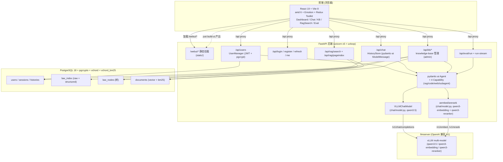

# LawRAG · 基于本地大模型的法律法规智能问答系统

> 本仓库实现课程实习需求《基于本地大语言模型的法律法规智能问答系统构建与 Agent 任务调度实践》。
> 系统以 NPC 法律法规数据库为数据源, 通过爬虫自建法律知识库, 用 RAG + 多工具 Agent 提供多轮法律问答服务, 并内置评估数据集与 LLM 评判链路。

## ✨ 特性

- 📚 **自建法律知识库**: 用 `scrapy` 异步爬虫抓取全国人大法律法规数据库, `markitdown` + `parse_multi_level` 把 docx 转结构化 JSON, 支持宪法/法律/行政法规/监察法规/司法解释五大类;
- 🔍 **混合检索**: 向量 (`qwen3-embedding` 4096 维) + BM25 (`vchord_bm25` + mmh3) 双索引, RRF 融合后用 `qwen3-reranker` 重排, 沿多级 `page index` 拼出面包屑;
- 🧠 **模型后端**: `llmserver/` 基于 vLLM 同时提供 chat / embedding / rerank 的 OpenAI 兼容 `/v1` 接口, 由 `model_launch.json` 管理 `qwen3.5`、`qwen3-embedding`、`qwen3-reranker`;
- 🤖 **多 Agent 协作**: pydantic-ai 编排 4 个可插拔工具集, 用户可勾选启用:
  - **RAG** (`rag_toolkit`) —— `find_laws / search_documents / get_article_by_path / get_law_articles / get_law_toc / browse_law`;
  - **Code** (`code_toolkit`) —— `python_repl` 基于 pydantic-monty 受限沙箱;
  - **Web** (`web_toolkit`) —— `search_web` (exa) + `fetch_web` (httpx2 + bs4);
  - **Subagent** (`subagent_toolkit`) —— 把任务委派给 `explore_agent`(纯检索) / `general_agent`(全工具);
- 💬 **流式多轮对话**: pydantic-ai `ModelMessage` 完整持久化到 PostgreSQL, 跨会话/重启上下文不丢;
- 🖥️ **可视化前端**: Vite 8 + React 19 + TypeScript 7.0-rc + antd 6 + Emotion + Redux Toolkit, 提供 Dashboard / Chat / KnowledgeBase / RagSearch / Eval 五个页面, Markdown 内嵌 Mermaid 与 Infographic;
- 📊 **评估闭环**: 内置 100 条以《劳动合同法》为主的问答样本 (满足"每组至少 100 条"要求), 用 pydantic-evals + LLMJudge 跑通, 已在 `examples/report.json` 保存评测结果;
- 🐳 **容器化**: 提供 `podman-compose` 一键拉起 PostgreSQL18 + llmserver + web 三个容器 (本地端口 `40001/40002/40003`).

## 🗂️ 仓库结构

```
lawrag/
├── backend/                # Python 3.14 FastAPI + pydantic-ai 法律 RAG 系统
│   ├── lawrag/
│   │   ├── __init__.py     # 把 httpx2 别名为 httpx
│   │   ├── __main__.py     # CLI 入口 (start / cli / search / eval / database / spider / pageindex)
│   │   ├── routers/        # FastAPI 路由 (auth / chat / rag / kb / eval / users / webui/*)
│   │   ├── chat/           # Agent 装配 + 4 个 capability + Subagent + vLLM 适配层
│   │   ├── database/       # pgvector + vchord_bm25 异步 ORM (User / Session / History / LawNode / Document / LawIndex)
│   │   ├── documents/      # 切分 / BM25 分词 / 法律层级解析 / docx 转换
│   │   ├── eval/           # pydantic-evals Case + LLMJudge (从 examples/case.json 读取)
│   │   ├── spider/         # scrapy 异步爬虫 (NPC 数据库)
│   │   └── environments.py # pydantic-settings 配置 + 自动向上查找 .proj_root
│   ├── tests/              # pytest (db marker 区分是否需要 PostgreSQL)
│   └── pyproject.toml
├── frontend/               # Vite 8 + React 19 + TypeScript 法律智能问答前端
│   ├── src/
│   │   ├── pages/          # Login / Dashboard / Chat / KnowledgeBase / RagSearch / Eval
│   │   ├── api/            # auth / chat / session / kb / rag / eval / types
│   │   ├── layouts/        # MainLayout (antd ProLayout 风格)
│   │   ├── components/     # SuperMarkdown (Markdown + Mermaid + Infographic)
│   │   ├── store/          # Redux Toolkit (authSlice)
│   │   └── utils/          # request.ts (fetch 封装) / navigateRef.ts (非组件内跳转桥接)
│   └── package.json
├── llmserver/              # vLLM 多模型后端, 提供 OpenAI 兼容 /v1 接口
│   ├── llmserver/          # FastAPI 路由 + ModelManager
│   ├── model_launch.json   # qwen3.5 / qwen3-embedding / qwen3-reranker 启动配置
│   └── pyproject.toml      # Python 3.14 + vLLM 0.25 依赖
├── docker/                 # podman-compose: postgres-age (pgcrypto+vchord_bm25) + llmserver + web
├── examples/               # 课程提交版产物
│   ├── case.json           # 100 条问答样本的 Case 设置
│   ├── report.json         # 100 条问答样本的 Agent 输出与 LLMJudge 评价
│   └── laws.tar.gz         # 爬虫抓取的法律法规 json 压缩包 (法律 + 宪法)
├── static/                 # `just build-ui` 把 frontend/dist 拷贝到这里, 由 FastAPI /webui/* 挂载
├── .proj_root              # 环境变量自动向上查找的仓库根标记
├── .env                    # POSTGRES_* / LLM_* 等环境变量
└── justfile                # 顶层一键命令 (web / initdb / setup / eval / ...)
```

各子模块的详细目录与模块说明见:

- [backend/README.md](backend/README.md) — FastAPI + pydantic-ai 法律 RAG 后端
- [frontend/README.md](frontend/README.md) — Vite + React 19 前端
- [llmserver/README.md](llmserver/README.md) — vLLM 多模型 OpenAI 兼容后端

## 🧰 技术栈

| 模块       | 选型                                                                                                                                                                                     |
| ---------- | ---------------------------------------------------------------------------------------------------------------------------------------------------------------------------------------- |
| 本地 LLM   | 仓库内 `llmserver/` 提供自托管 OpenAI 兼容 vLLM 后端 (`qwen3.5`)，`backend/lawrag/chat/model.py` 通过 `LLM_LINK` 调用                                                                  |
| 模型后端   | `llmserver` (FastAPI + vLLM 0.25)，按 `llmserver/model_launch.json` 同时加载 `qwen3.5`、`qwen3-embedding`、`qwen3-reranker`，暴露 `/v1/chat/completions`、`/v1/embed`、`/v1/rerank` 等接口 |
| 文档爬取   | Python `scrapy` (`AsyncCrawlerRunner`) + 可选 `selenium`                                                                                                                                 |
| 文本切分   | `spaCy` + `zh_core_web_trf` 句切分 + token overlap                                                                                                                                       |
| 嵌入/重排  | `qwen3-embedding` (4096 维) + `qwen3-reranker`，统一通过 `LLM_LINK`（`chat` 与 `embedder` 复用同一端点）                                                                                 |
| 检索       | PostgreSQL 18 + `pgvector` (vector/halfvec/sparsevec) + `vchord` / `vchord_bm25` (BM25)                                                                                                  |
| Agent 框架 | pydantic-ai (Agent + Capability + Subagent)                                                                                                                                              |
| 系统界面   | FastAPI 0.119 (uvicorn 5 workers) + Vite 8 / React 19 / antd 6 / Emotion                                                                                                                 |

> 默认部署把 chat 与 embedding/rerank 集中到同一个 OpenAI 兼容 vLLM 端点（即同一个 `LLM_LINK`），可直接使用仓库内 `llmserver/` 启动模型后端；`.env` 中的 `LLM_PROTOCOL/LLM_HOST/LLM_PORT` 会拼出 `LLM_LINK = <scheme>://<host>:<port>/v1`。

## 🚀 快速开始

### 前置条件

- Python **3.14 (< 3.15)**, 推荐 [uv](https://docs.astral.sh/uv/) 管理依赖
- Node ≥ 24 [pnpm](https://pnpm.io/) 管理前端依赖
- 可达的 PostgreSQL 18 (带 `pgcrypto` / `vchord` / `vchord_bm25` 扩展)
- 可达的 OpenAI 兼容 vLLM 端点：用仓库内 `llmserver/` 启动模型后端；`.env` 中 `LLM_*` 必须可用 (chat / embedding / rerank 都走同一个 `LLM_LINK`)，

### 1. 配置环境变量

配置在 `.env` 中。`find_project_directory()` 沿父目录向上找 `.proj_root` 后加载。

示例:

```dotenv
# FastAPI
FASTAPI_HOST
FASTAPI_PORT

# PostgreSQL
POSTGRES_HOST
POSTGRES_PORT
POSTGRES_USER
POSTGRES_DB
POSTGRES_PASSWORD

# 自托管 LLM (llmserver)
LLM_PROTOCOL
LLM_HOST
LLM_PORT
LLM_API_KEY
```

### 2. 启动模型后端 (llmserver)

如需本机自托管模型端点，可启动仓库内 `llmserver/`。它基于 vLLM 暴露 OpenAI 兼容 `/v1` 接口，并按 `model_launch.json` 加载 chat / embedding / rerank 三类模型。

```bash
just llmserver
```

可用接口包括 `/v1/health`、`/v1/models`、`/v1/chat/completions`、`/v1/embed`、`/v1/rerank`。

### 3. 启动数据库与依赖

任选其一:

```bash
# 方式 A: 本机已装 PostgreSQL 18 + 扩展 (默认连 127.0.0.1:10004)
just initdb      # 装扩展 + 创建默认账号 admin/admin

# 方式 B: podman-compose 拉容器 (主机端口 40002 -> 容器 5432; 主机端口 40003 -> llmserver; 主机端口 40001 -> web)
#         需把 .env 中的 POSTGRES_PORT/LLM_PORT 改为 40002/40003
just docker      # database + llmserver + web 一起起
just database    # 仅数据库
just web-docker  # 仅 web
```

### 4. 抓取 → 解析 → 入库 → 嵌入

```bash
just spider-crawl         # NPC 数据库索引 → law_index 表
just spider-download      # 下载 docx 并解析, raw/structured 写回 law_index 表
just pageindex-import     # law_index.structured → law_nodes
just pageindex-embed      # 把法条分块并嵌入到 documents 表 (最耗时)
```

或一行:

```bash
just setup
```

### 5. 启动服务

```bash
# 后端 (终端 1)
just web              # http://127.0.0.1:40001

# 前端开发服务器 (终端 2, 带 /api 代理)
just ui               # http://127.0.0.1:5173/webui/

# 或者一次性构建前端并由后端托管
just build-ui         # 输出到 ./static/, 后端 /webui/* 自动挂载
```

打开 <http://127.0.0.1:40001/webui/>, 默认管理员账号 `admin/admin`。

### 6. 跑评估 (课程要求 ≥ 100 条问答)

```bash
just eval             # 全量 100 条, 报告默认写到 ./lawrag_eval_report.json
just eval 20          # 仅跑前 20 条
```

仓库已补充 `examples/report.json` 作为 100 条问答样本的评测结果，可直接对应课程提交要求。

报告 JSON 与课程需求模板一致, 字段对应:

| 需求字段          | 报告字段                                                  |
| ----------------- | --------------------------------------------------------- |
| `question`        | `question`                                                |
| `expected_answer` | `expected_answer`                                         |
| `model_output`    | `model_output`                                            |
| `evaluation_note` | `evaluation_note`                                         |
| (额外)            | `success` (`LLMJudge` 通过标记), `error_message` (若失败) |

## 🛠️ 顶层命令一览 (justfile)

| 命令                                                 | 作用                                                                                    |
| ---------------------------------------------------- | --------------------------------------------------------------------------------------- |
| `just llmserver`                                     | 启动 vLLM 多模型推理后端                                                               |
| `just setup`                                         | initdb → spider-crawl → spider-download → pageindex-import → pageindex-embed → build-ui |
| `just web`                                           | 启动 FastAPI (uvicorn 5 workers)                                                        |
| `just initdb` / `db-reset` / `db-clean`              | 数据库初始化/重置/清空                                                                  |
| `just spider-crawl CATEGORY=all`                     | 抓取 NPC 法规索引                                                                       |
| `just spider-download`                               | 下载 + 解析 (从 DB law_index 表读候选)                                                  |
| `just pageindex-convert [FILTER]`                    | raw → structured (无需重新下载)                                                         |
| `just pageindex-import [LAW]`                        | structured → law_nodes                                                                  |
| `just pageindex-embed [LAW] SIZE OVERLAP BATCH`      | law_nodes → documents (可调分块大小)                                                    |
| `just search QUERY [LIMIT=5]`                        | 走混合检索 CLI                                                                          |
| `just eval [LIMIT]`                                  | 跑内置 100 条法律问答评测                                                               |
| `just ui`                                            | 前端开发                                                                                |
| `just build-ui`                                      | 前端 build + 拷贝到 `static/`                                                           |
| `just backend-format\|lint\|typecheck`               | Python 格式化/lint/类型检查                                                             |
| `just frontend-check\|typecheck`                     | 前端格式化+lint/biome/类型检查                                                          |
| `just docker` / `just database` / `just docker-down` | 容器编排                                                                                |
| `just web-docker`                                    | 仅起 web 容器                                                                           |

## 🧱 架构示意



## 🧪 测试

```bash
cd backend

uv run pytest                    # 全部
uv run pytest -m "not db"        # 跳过依赖真实数据库的测试
uv run pytest -m "db"            # 仅跑需要 db 的测试
uv run pytest tests/test_lawparser.py -k parse_multi_level -v
```

测试样例位于 `backend/tests/`:

- `test_lawparser.py` —— 离线：中文数字解析、层级结构扁平化、TOC 构建等
- `test_document.py` —— 离线：DocumentStore / Embedder / splitter
- `test_eval.py` —— 离线：eval 数据模型
- `test_rag.py` —— 离线：search API 请求校验
- `test_user_auth.py` —— `@pytest.mark.db`：JWT 签发/校验、用户 CRUD
- `test_law_index.py` —— `@pytest.mark.db`：law_index CRUD
- `test_pageindex.py` —— `@pytest.mark.db`：导入、列出、按条号取、按 path 取、TOC、删除

`llmserver` 测试位于 `llmserver/tests/`（如添加，需自行建目录）；模型加载类用例默认不在线。

## 📦 数据落盘约定

默认数据根为 `<repo>/data/`, 通过 `LAWRAG_DATA_ROOT` 覆盖:

```txt
data/
├── downloaded_laws/<uuid>.docx            # spider download 原始文件
└── eval/report.json                        # (历史) 旧版 eval 默认输出
```

新版本 `just eval` 默认把报告写到仓库根 `lawrag_eval_report.json`；法律索引、原始文本与结构化层级数据均存入 PostgreSQL `law_index` 表 (`raw` TEXT 列 + `structured` JSONB 列)，不再落盘。

## 🔐 配置参考

见 [backend/README.md#配置](backend/README.md#配置)。`EnvironmentSettings` (`backend/lawrag/environments.py`) 自动沿父目录向上查找 `.proj_root` 标记并加载 `<repo>/.env`; 未找到则退到 `backend/.venv`。

> 所有 Python 子模块通过 `lawrag/__init__.py` 把 `httpx2` 别名为 `httpx`，因此上游库仍可用 `import httpx` 但实际取到 `httpx2`。

## 📝 需求对应表

| 需求条目               | 本仓库位置                                                                                                  |
| ---------------------- | ----------------------------------------------------------------------------------------------------------- |
| 学习并部署本地 LLM     | `backend/lawrag/chat/model.py` (`VLLMChatModel`/`VLLMProvider` + `aembed_documents` + `arerank_documents`) + `llmserver` |
| 编写爬虫, 爬取法律法规 | `backend/lawrag/spider/` (law_spider / content_spider / runner / pipelines)                                 |
| 文档清洗、分段, 向量化 | `backend/lawrag/documents/` (nlp.py: spacy 句切分 + mmh3 BM25) + `database/document.py` (DocumentStore)     |
| 构建 RAG 问答系统      | `backend/lawrag/database/ragsearch.py` (向量+BM25 RRF + rerank + 多级 page index 面包屑)                    |
| 引入 Agentic Framework | `backend/lawrag/chat/` (pydantic-ai Agent + 4 Capability + 2 Subagent)                                      |
| FastAPI 演示界面       | `backend/lawrag/routers/` (auth/chat/rag/kb/eval/users) + `frontend/` (由 FastAPI `/webui/*` 挂载)          |
| 项目技术文档           | 本 README + `backend/README.md` + `frontend/README.md` + `llmserver/README.md`                              |
| **≥ 100 条测试样本**   | `backend/lawrag/eval/dataset.py` + `examples/case.json` (100 条) + `examples/report.json` (LLMJudge 结果)  |
