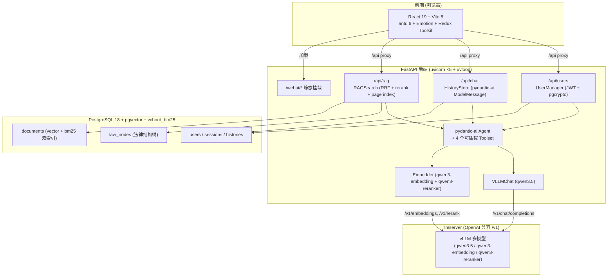

# LawRAG 实验报告

> 课程实习项目：基于本地大语言模型的法律法规智能问答系统构建与 Agent 任务调度实践

---

## 一、项目概述

本系统以全国人大（NPC）法律法规数据库为数据源，构建了一个完整的本地大模型法律智能问答平台。核心链路为：**爬虫采集 → 文档解析 → 向量/BM25 混合检索 → RAG + 多工具 Agent 推理 → 流式对话 → 评测闭环**。

系统由三个子模块组成，均部署在同一台机器上：

| 模块 | 功能 | 技术栈 |
|------|------|--------|
| `llmserver` | 模型推理服务 | Python 3.14 + vLLM 0.24，提供 OpenAI 兼容 `/v1` 接口 |
| `backend` | RAG + Agent + API | Python 3.14 + FastAPI + pydantic-ai + PostgreSQL 18 |
| `frontend` | Web UI | Vite 8 + React 19 + TypeScript + antd 6 |

---

## 二、系统架构



**数据流**：用户在前端输入问题 → 后端 `/api/chat` 接收 → Agent 根据启用的 Toolset 决定调用 RAG 检索、Web 搜索、代码执行或委派 Subagent → 模型生成答案 → SSE 流式返回前端。

---

## 三、llmserver · 模型推理服务

### 3.1 功能定位

为后端提供统一的 OpenAI 兼容模型推理端点，同进程中串行加载 chat、embedding、rerank 三类模型。

### 3.2 模型配置

`model_launch.json` 管理模型启动参数，与后端模型 ID 严格对齐：

| 用途 | model_uid | 模型仓库 | 模型类型 |
|------|-----------|----------|----------|
| Chat / Agent | `qwen3.5` | Qwen/Qwen3.5-122B-A10B-GPTQ-Int4 | LLM (generate + tool_call) |
| 嵌入 | `qwen3-embedding` | Qwen/Qwen3-VL-Embedding-8B | embedding |
| 重排 | `qwen3-reranker` | Qwen/Qwen3-VL-Reranker-8B | rerank |

### 3.3 核心接口

- `/v1/chat/completions` — 对话与工具调用（`enable_auto_tool_choice` + `tool_call_parser`）
- `/v1/embeddings` — 文本向量化（4096 维）
- `/v1/rerank` — 文档重排序
- `/v1/health`, `/v1/models` — 健康检查与模型列表

### 3.4 技术细节

- 基于 vLLM 0.24 + CUDA 13，支持 GPTQ Int4 量化
- AsyncLLM 异步引擎，5 workers + uvloop
- 媒体预处理支持文档/音频/图像（markitdown + LRU 缓存）

---

## 四、backend · RAG + Agent 后端

### 4.1 数据采集管线

#### 爬虫系统

基于 scrapy（`AsyncCrawlerRunner`，无 Twisted reactor）异步爬取 NPC 法律法规数据库。

- **LawIndexSpider**：抓取法律索引，调用 `/law-search/search/list` JSON API 翻页
- **ContentDownloadSpider**：通过签名 URL 下载 docx，经 markitdown 转纯文本，再用 `parse_multi_level` 解析为结构化 JSON

支持的法律分类：宪法、法律、行政法规、监察法规、司法解释、地方性法规（可选）。

#### 文档处理管线

```
NPC 数据库 → spider crawl → law_index.json
           → spider download → *.docx
           → markitdown → *.txt (raw_laws/)
           → parse_multi_level → *.json (structured_laws/)
           → pageindex import → law_nodes 表 (法律结构树)
           → spacy 句切分 + mmh3 BM25 分词 → 嵌入 → documents 表
```

### 4.2 混合检索系统

采用 **向量检索 + BM25 关键词检索 + RRF 融合 + 重排序** 四级流水线：

1. **向量检索**：qwen3-embedding 生成 4096 维向量，pgvector HNSW 索引
2. **BM25 检索**：spaCy (`zh_core_web_trf`) 分词，mmh3 哈希到 100 万词表，vchord_bm25 稀疏索引
3. **RRF 融合**：对向量和 BM25 结果进行 Reciprocal Rank Fusion
4. **重排序**：qwen3-reranker 对融合结果重排
5. **面包屑生成**：沿多级 page index 拼出法律层级路径

### 4.3 Agent 系统

基于 pydantic-ai 框架编排，提供 4 个可插拔 Toolset。用户在前端可勾选启用：

| Toolset | 工具 | 能力 |
|---------|------|------|
| **RAG** | `find_laws`, `search_documents`, `get_article_by_path`, `get_law_articles`, `get_law_toc`, `browse_law` | 法律检索与浏览 |
| **Code** | `python_repl` | 受限 Python 沙箱（pydantic-monty） |
| **Web** | `search_web`, `fetch_web` | 网络搜索（exa-api）+ 网页抓取（httpx + bs4） |
| **Subagent** | `explore_agent`, `general_agent` | 任务委派：纯检索子代理 / 全工具子代理 |

### 4.4 API 接口

- **鉴权**：`/api/users/login`, `/api/users/register`, `/api/users/refresh`, `/api/users/me`（JWT HS256 + pgcrypto 密码哈希）
- **对话**：`/api/chat/{session_id}/stream`（SSE 流式，pydantic-ai ModelMessage 完整持久化，跨会话/重启上下文不丢）
- **检索**：`/api/rag/search`, `/api/rag/pageindex/*`（法律浏览/查询/目录）
- **前端**：`/webui/*`（挂载静态资源）

### 4.5 技术依赖

| 类别 | 选型 |
|------|------|
| Web 框架 | FastAPI + uvicorn (5 workers, uvloop) |
| AI 编排 | pydantic-ai |
| 数据库 | PostgreSQL 18 + pgvector + vchord / vchord_bm25 |
| ORM | SQLAlchemy / SQLModel 异步 |
| NLP | spaCy + zh_core_web_trf |
| 文档解析 | lxml, beautifulsoup4, markitdown |
| 代码沙盒 | pydantic-monty |
| CLI | typer |

---

## 五、frontend · Web 前端

### 5.1 功能定位

提供法律智能问答可视化界面，构建后由后端 FastAPI 在 `/webui/*` 挂载。

### 5.2 页面结构

| 页面 | 功能 |
|------|------|
| LoginPage | 用户登录（默认 admin/admin） |
| DashboardPage | 控制面板 |
| ChatPage | 流式多轮对话，支持 Markdown + Mermaid + Infographic 渲染 |

### 5.3 技术栈

| 类别 | 选型 |
|------|------|
| 构建工具 | Vite 8 + @vitejs/plugin-react (React Compiler) |
| 框架 | React 19 + react-router 7/8 |
| UI 库 | antd 6 + @ant-design/x + @ant-design/x-markdown + @ant-design/charts + @antv/infographic |
| 样式 | @emotion/react + @emotion/styled |
| 状态管理 | Redux Toolkit + react-redux |
| 类型 | TypeScript 7.0-rc (strict) |
| 质量 | Biome (lint + format) + tsc --noEmit |

### 5.4 鉴权与路由

- JWT token 存储在 localStorage，由 `request.ts` 统一附加 `Authorization: Bearer ...`
- 401 响应自动跳转登录页
- react-router `basename="/webui"` 与后端挂载路径对齐

---

## 六、评测系统

### 6.1 评测设计

内置 **100 条以《劳动合同法》为主的问答样本**（满足课程"每组至少 100 条"要求），基于 pydantic-evals 框架 + LLMJudge 自动评判。

### 6.2 评测流程

```
Agent 回答 → LLMJudge 对比标准答案 → 输出 LawRagCaseReport
```

### 6.3 报告字段

| 字段 | 说明 |
|------|------|
| `question` | 问题 |
| `expected_answer` | 标准答案 |
| `model_output` | Agent 实际输出 |
| `evaluation_note` | LLMJudge 评判备注 |
| `success` | 是否通过评判 |
| `error_message` | 失败原因（如有） |

### 6.4 运行方式

```bash
just eval        # 全量 100 条
just eval 20     # 仅跑前 20 条

# 输出默认路径: <DATA_ROOT>/eval/report.json
# 课程提交版本: examples/report.json
```

---

## 七、部署与运行

### 7.1 环境要求

- Python 3.14 (< 3.15)，uv 管理依赖
- Node ≥ 24，pnpm 管理前端依赖
- PostgreSQL 18（含 pgcrypto、vchord、vchord_bm25 扩展）
- NVIDIA GPU + CUDA 13（用于 llmserver）

### 7.2 启动流程

```bash
# 1. 配置 .env
# 2. 启动模型后端
just llmserver

# 3. 初始化数据库
just initdb

# 4. 一键数据管线 (爬取 → 解析 → 入库 → 嵌入)
just setup

# 5. 启动服务
just web          # 后端 http://127.0.0.1:40001
just ui           # 前端 http://127.0.0.1:5173/webui/
# 或
just build-ui     # 构建前端，后端直接托管

# 6. 跑评测
just eval
```

### 7.3 容器化部署

`docker/` 提供 `podman-compose` 配置，一键拉起 PostgreSQL 18 + Web 应用容器（端口 `40001`/`40002`）。

---

## 八、常用命令速查

| 命令 | 作用 |
|------|------|
| `just setup` | initdb → crawl → download → import → embed → build-ui |
| `just web` | 启动 FastAPI |
| `just llmserver` | 启动模型推理服务 |
| `just initdb` | 数据库初始化（扩展 + 默认账号） |
| `just spider-crawl` | 抓取 NPC 法规索引 |
| `just spider-download` | 下载 + 解析 docx |
| `just pageindex-import` | 结构化数据入库 |
| `just pageindex-embed` | 法条分块嵌入 |
| `just eval [LIMIT]` | 跑内置 100 条评测 |
| `just ui` | 前端开发服务器 |
| `just build-ui` | 构建前端静态资源 |
| `just docker` | 容器化部署 |
| `just backend-format/lint/typecheck` | 代码质量检查 |
| `just frontend-check/typecheck` | 前端代码质量检查 |

---

## 九、课程需求对应

| 需求条目 | 实现位置 |
|----------|----------|
| 学习并部署本地 LLM | `llmserver/` (vLLM) + `backend/lawrag/chat/chat_model.py` |
| 编写爬虫，爬取法律法规 | `backend/lawrag/spider/` (scrapy 异步爬虫) |
| 文档清洗、分段，向量化 | `backend/lawrag/documents/` (spaCy 句切分 + BM25 + 嵌入) |
| 构建 RAG 问答系统 | `backend/lawrag/database/ragsearch.py` (向量+BM25 RRF+Rerank) |
| 引入 Agentic Framework | `backend/lawrag/chat/` (pydantic-ai Agent + 4 Toolset + 2 Subagent) |
| FastAPI 演示界面 | `backend/lawrag/routers/` + `frontend/` |
| ≥ 100 条测试样本 | `backend/lawrag/eval/dataset.py` 内置 100 条，`examples/report.json` |
| 项目技术文档 | 本报告 + 各模块 README.md |
